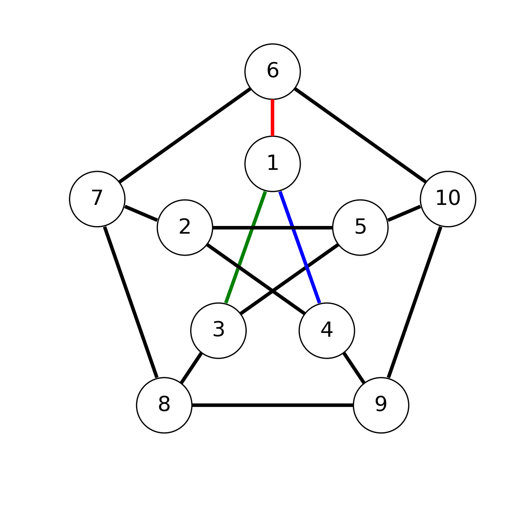
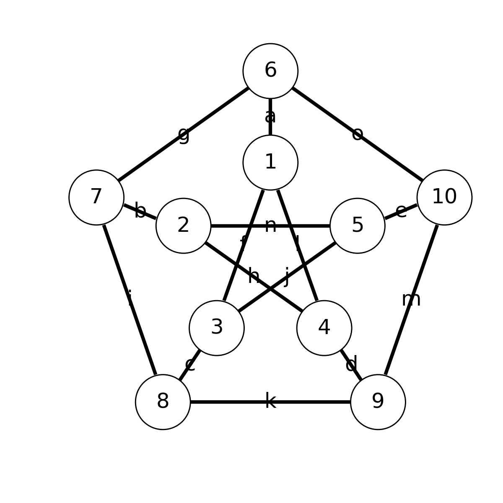

# An Introduction to differentiable tensors

Slides and notebooks for [集智(ji zhi) club](www.swarma.org)

## Table of Contents

* [3-coloring couting problem solved by a tensor network](notebooks/3-coloring-couting.ipynb)
* [Graph embeding problem solved by differential programming](notebooks/graph_embeding.ipynb)
* [Quantum circuit ABC](notebooks/qc-abc.ipynb)
* [Mapping a tensor network to a quantum circuit](notebooks/qc_tensor_mapping.ipynb)
* [Solving the ground state problem with differential programming and variational quantum circuit](notebooks/variational_quantum_circuit.ipynb)

## Blog

图论中有个重要的问题叫做三色问题。作为例子，考虑下图



一个图由顶角V和连边E构成，上图中每个顶角的度都是三，即每个顶角有三条边与之相连。现给图片的每个边E上色，可以是RGB（红绿蓝）三色中的一个。问有多少中方式图给这个图的每条边都上色，使得每个顶角相连的三条边的颜色互不相同。上图给1号顶角的连边给了一种可能的着色，而剩余的连边待定。

这个图也叫Petersen图，是图论中非常有名的图，它一共有10个顶角和15条边。因此遍历所有连边的涂色是可能的，它的计算复杂度仅为$3^{15}\approx 1.4\times10^6$，我们不妨用穷举法来解答。穷举需要用到15重循环，循环的变量可以用$a-o$来命名，如下图所示

下面展示用于暴力求解的[Julia](https://julialang.org/)代码，打开julia的REPL粘贴即可执行

```julia
# naive looping
satisfied(i, j, k) = i!=j && j!=k && k!=i ? 1 : 0

"""
count the number of possible 3-coloring for a Petersen Graph.
The naive loop version.
"""
function petersen_coloring()
    res = 0
    for a=1:3, b=1:3, c=1:3, d=1:3, e=1:3, f=1:3, g=1:3,
        h=1:3, i=1:3, j=1:3, k=1:3, l=1:3, m=1:3, n=1:3, o=1:3
        res += satisfied(a,f,l)*satisfied(b,h,n)*satisfied(c,j,f)*
        satisfied(d,l,h)*satisfied(e,n,j)*satisfied(a,g,o)*satisfied(b,i,g)*
        satisfied(c,k,i)*satisfied(d,m,k)*satisfied(e,o,m)
    end
    res
end

petersen_coloring()
```

上面的求解中，我们用到的函数`satisfied(i,j,k)`代表了一个节点的填色是否满足要求，这里用1,2,3代表了RGB三种颜色，循环体中，只有所有节点的限定条件都被满足，这个填色方案才贡献1。注意到这里函数的输入维度是有限的，它可以用一个三阶张量`s[i,j,k] := satisfied(i,j,k)`来表达，上图很自然的映射到了**张量网络**的指标求和问题
$$
y = \sum\limits_{a,b\ldots o=1}^3 s_{afl}s_{bhn}\ldots s_{eom}
$$
省去前面大大的求和记号，就可以得到爱因斯坦记号表示
$$
y = s_{afl}s_{bhn}\ldots s_{eom}
$$
爱因斯坦记号意思是，将上图张量的角标中，成对指标的维度收缩（即求和），而同指标求和也被称为张量收缩，在在物理领域是非常常见的操作。爱因斯坦自己曾调侃道这是数学史上的一项重要发现

> "I have made a great discovery in mathematics; I have suppressed the summation sign every time that the summation must be made over an index which occurs twice..."


过了将近一个世纪，程序员们（可能是`numpy`的工程师）把这套记号发展得更加强大，除了同指标收缩，它还可以表达`trace`, `sum`等常见操作，比如

```julia
"ii->"
```

代表了一个二阶输入张量，用`A[i,i]`进行指标索引，输出为0阶张量 (标量)`C[]`。对指标`i`进行循环，将输入的张量对应位置元素累加到输出上，即代表`trace`。

```julia
"ij,jk->ik"
```

代表了两个二阶输入张量，分别用`A[i,j]`和`B[j,k]`进行指标索引，输出为二阶张量`C[i,k]`。对所有出现的指标`ijk`进行循环，将输入的张量对应位置元素的**乘积**累加到输出的对应元素上。

这个张量的拓扑与原图同构，原图的顶角映射成为了一个张量，而边映射成为张量的一个收缩维度。

```julia
using OMEinsum
s = map(x->Int(length(unique(x.I)) == 3), CartesianIndices((3,3,3)))
ein"afl,bhn,cjf,dlh,enj,ago,big,cki,dmk,eom->"(fill(s, 10)...)
```

最后输出的结果为$0$，意味着一个满足要求的涂色都没有。上面用到了爱因斯坦求和记号，



一类类似但更加重要的问题叫做3-SAT问题。假设我们有一堆Bool型变量$\{x_1, x_2, \ldots, x_n\}​$，我们可以用这些变量作Bool代数构造一些Clause，比如$C_1 := x_1 \land x_2 \lor x_3​$。
Clause $C_1$ 的真值表是

| $x_1, x_2, x_3$ | $C_1$ |
| --------------- | ----- |
| 000             | 0     |
| 100             | 0     |
| 010             | 0     |
| 110             | 1     |
| 001             | 1     |
| 101             | 1     |
| 011             | 1     |
| 111             | 1     |

一个3-SAT的判定版本，即判断一个3-SAT问题有没有解被证明是NP-complete困难的，也就是一般不认为存在经典的算法能在多项式时间之内把它求解。而计算出3-SAT解的个数是相对更加困难的问题。